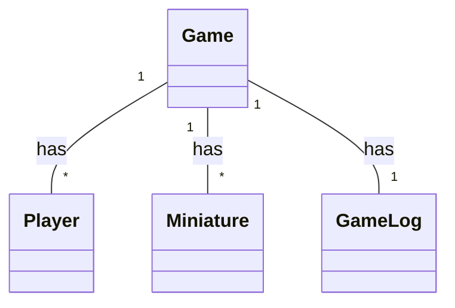
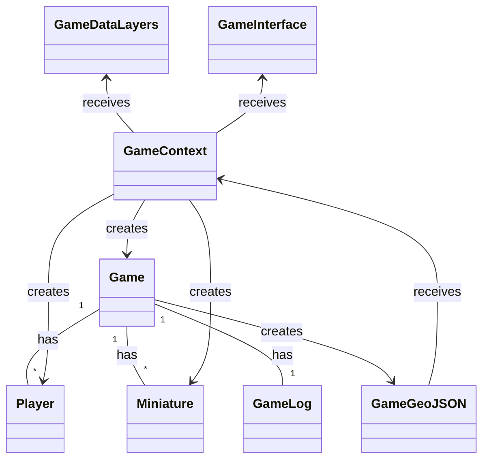

# Cosmic Ork Conflict

Cosmic Ork Conflict is a turn-based strategy game featuring AI players competing against each other. Each player controls an army of Orks, and must use strategy and tactics to defeat their opponent. The game is played in rounds, with each player taking turns to move and attack with their miniatures. The ultimate goal is to be the last player with surviving miniatures, claiming victory for their Ork clan.

## Getting Started
To get started with Cosmic Ork Conflict, you will need to clone this repository and install the dependencies.

```
git clone https://github.com/cioddi/cosmic-ork-conflict.git
cd cosmic-ork-conflict
yarn
```

Once the dependencies are installed, you can start the game by running the following command:


```
yarn start
```
This will launch the game, and the AI players will begin their battle. You can watch the game unfold in the console, or view the game log to see the details of each round.

## Classes
Some mermaid diagrams.





## Development

If you want to contribute to the development of Cosmic Ork Conflict, you can fork this repository and make your changes. Once you are satisfied with your changes, you can submit a pull request for review.

## License

Cosmic Ork Conflict is licensed under the MIT License.
