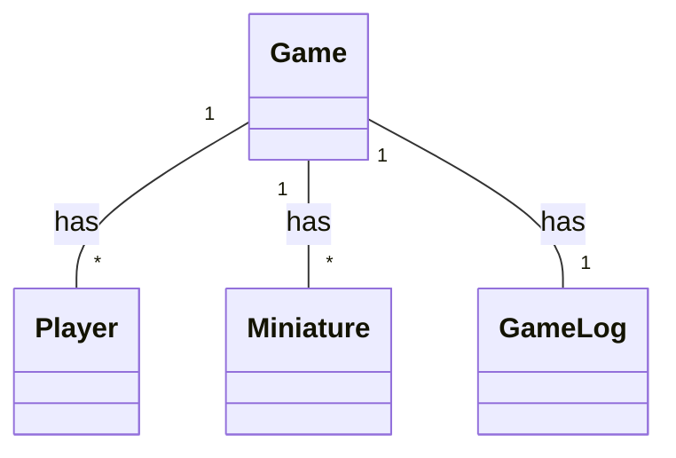
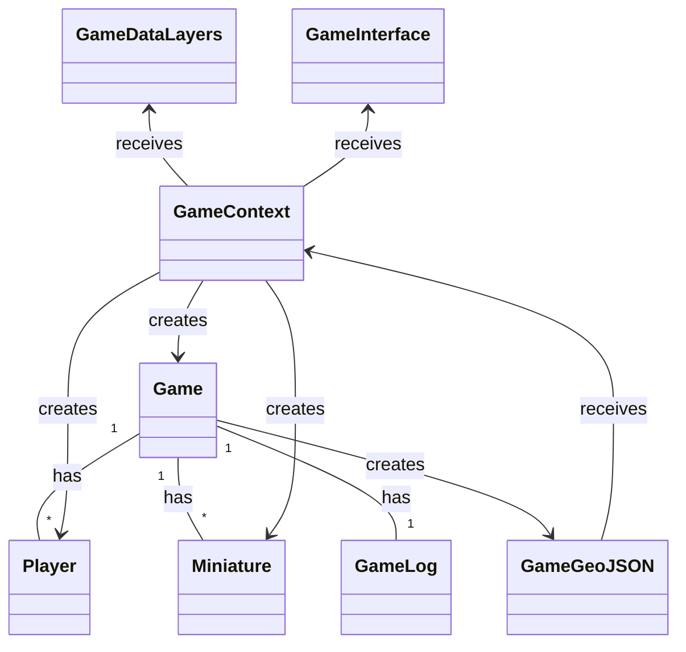

# Cosmic Ork Conflict

Cosmic Ork Conflict is a turn-based strategy game featuring AI players competing against each other. Each player controls an army of Orks, and must use strategy and tactics to defeat their opponent. The game is played in rounds, with each player taking turns to move and attack with their miniatures. The ultimate goal is to be the last player with surviving miniatures, claiming victory for their Ork clan.

## Getting Started

Cosmic Ork Conflict requires Node.js 22.13 or newer and npm. Clone the
repository and install the locked dependency set:

```sh
git clone https://github.com/cioddi/cosmic-ork-conflict.git
cd cosmic-ork-conflict
npm ci
```

Start the Vite development server:

```sh
npm run dev
```

Open the local URL printed by Vite. Build armies in the workshop and deploy a
match when you are ready.

## Classes
Some mermaid diagrams.


```mermaid
classDiagram
Game "1" -- "*" Player: has
Game "1" -- "*" Miniature: has
Game "1" -- "1" GameLog: has
```


```mermaid

classDiagram
Game "1" -- "*" Player: has
Game "1" -- "*" Miniature: has
Game "1" -- "1" GameLog: has
GameContext --> Game: creates
GameContext --> Player: creates
GameContext --> Miniature: creates
Game --> GameGeoJSON: creates
GameContext <-- GameGeoJSON: receives
GameDataLayers <-- GameContext: receives
GameInterface <-- GameContext: receives
```

## Development

If you want to contribute to the development of Cosmic Ork Conflict, you can fork this repository and make your changes. Once you are satisfied with your changes, you can submit a pull request for review.

### Game world architecture

The simulation loads and decodes its own vector tiles and builds an immutable,
renderer-neutral world model before a game begins. MapLibre consumes snapshots
from the engine and is not a source of collision or navigation state.

The architecture, collision guarantees, animation contract, test strategy, and
safe adjustment points are documented in
[`GAME_WORLD_NAVIGATION_PLAN.md`](GAME_WORLD_NAVIGATION_PLAN.md).

Army construction, point balancing, local persistence validation, and match
setup are documented in [`ARMY_BUILDER.md`](ARMY_BUILDER.md).

Useful verification commands:

```sh
npm run lint
npm run typecheck
npm run test:ci
npm run build
```

Run the complete local gate with:

```sh
npm run verify
```

`npm run build` type-checks the application and writes the deployable Vite build
to `docs/`. `npm run preview` serves that production output locally.

The Create React App to Vite migration, dependency decisions, and maintenance
notes are documented in [`VITE_MIGRATION.md`](VITE_MIGRATION.md).

## License

Cosmic Ork Conflict is licensed under the MIT License.
